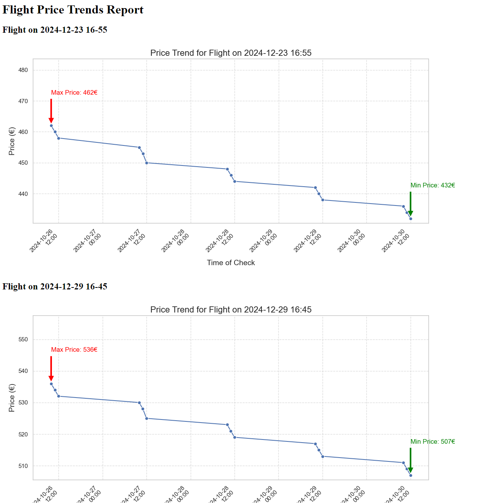

# Flight Poller

The **Flight Poller** is a Python script designed to monitor flight prices from a specified URL. It checks for price drops and limited seat availability on selected flight dates and sends email alerts accordingly. Additionally, it logs flight prices over time, allowing for data visualization using an optional script.

## Table of Contents

- [Features](#features)
- [Prerequisites](#prerequisites)
- [Installation](#installation)
- [Configuration](#configuration)
- [Usage](#usage)
- [Data Visualization (Optional)](#data-visualization-optional)
- [Error Handling](#error-handling)

---

## Features

- **Flight Monitoring**: Fetches flight data from a specified URL and monitors selected flight dates.
- **Price Alerts**: Sends email notifications when flight prices drop below a specified threshold.
- **Limited Seat Alerts**: Notifies when there are limited seats available for monitored flights.
- **Data Logging**: Logs flight prices over time into a CSV file for historical tracking.
- **Data Visualization (Optional)**: Generates visualizations of flight price trends over time.

## Prerequisites

- Python 3.6 or higher
- Required Python packages:
  - `requests`
  - `beautifulsoup4`
  - `smtplib` (comes with Python's standard library)
  - `email` (comes with Python's standard library)
  - `pandas` (for data visualization)
  - `matplotlib` (for data visualization)
  - `seaborn` (for enhanced plots)

## Installation

1. **Clone the Repository**

   ```bash
   git clone https://github.com/elilampinen/flight-price-data-poller.git
   cd flight-price-data-poller
   ```

2. **Create a Virtual Environment (Optional but Recommended)**

   ```bash
   python3 -m venv venv
   source venv/bin/activate  # On Windows use `venv\Scripts ctivate`
   ```

3. **Install Required Packages**

   ```bash
   pip install -r requirements.txt
   ```

## Configuration

Create a `configFile.py` in the root directory of the project with the following variables:

```python
# configFile.py

email_sender = 'youremail@example.com'
email_password = 'your-email-password'
email_receivers = ['receiver1@example.com', 'receiver2@example.com']

# Dates to track in the format 'DD-MM-YYYY · HH:MM'
dates_to_track = [
    '13-12-2024 · 16:23',
    '19-12-2024 · 16:33',
    '10-12-2024 · 16:51'
]

price_threshold = 500  # Alert when price is below this value
url = 'https://example.com/flight-data-url'
host = 'example.com'
env = 'prod'  # Set to 'dev' for development or 'prod' for production
```

**Note**: Ensure that your email account allows SMTP access.

## Usage

To start monitoring flight prices, simply run:

```bash
python flight_price_monitor.py
```

The script will:
- Fetch flight data from the specified URL.
- Check for price drops and limited availability.
- Send email alerts if necessary.
- Log flight prices into a CSV file for historical tracking.

### Running Periodically

For continuous monitoring, it's recommended to set up a scheduled task or cron job. Here are a few examples:

**Linux (cron job)**:

```bash
# Run every hour
0 * * * * /path/to/your/venv/bin/python /path/to/flight_price_monitor.py
```

**Windows (Task Scheduler)**:

- Use Task Scheduler to run the script every hour or at a frequency of your choosing.

## Data Visualization (Optional)

There is an optional script available to visualize the flight price data over time. This script can be used to generate plots for analysis.

To use the visualizer script:

```bash
python visualize_prices.py
```

This will generate visualizations of the price trends for each flight date being monitored. This includes seperate .png files for every flight you are monitoring and html page for everything.

Example html file




## Error Handling

- Errors are logged to an `error_log.txt` file.
- API request errors are logged to `api_error_log.json`.
- If an error occurs during the flight data fetch, an email alert will be sent to notify you.
